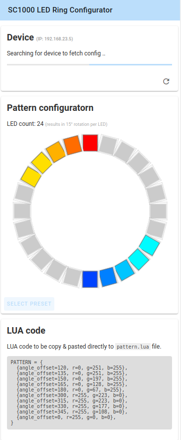

# SC LED Ring configurator app

This is a web app to configure the LED pattern.

It can be used as a standalone page to generate the `PATTERN` to copy and paste to your LUA code or can connect directly to the device via it's proviced wifi access point.

[](http://sc1000.wbcrew.de/)

Hosted version: [sc1000.wbcrew.de](http://sc1000.wbcrew.de/)

## Usage

@TODO: 2 modes, just webpage or with wifi, explain hardcoded IP ..


## Problem (HTTP vs HTTPS)

The app is build as a progressive web app (PWA) with the [Svelte framework](https://svelte.dev/), so it can be usesd as a normal web page or being installed as an app ("Add to Home Screen"). **But** sadly the ESP can't server HTTPS requests, which is a requirement of a PWA (and JS ServiceWorker). If we use it as a PWA with HTTPS, the browser will block all requests to HTTP resources (including to the IP of the ESP). 
So technically we can only use it in the browser, when trying to directly connect to the ESP. When served via HTTP we can't isntall it as an app on the decive either.


## Web applciation

### Development

Start local development server:

```bash
npm i
npm run dev
```

#### web links

* Svelte Examples: https://svelte.dev/examples
* Svelte Material UI: https://sveltematerialui.com/
* Material Icons: https://material.io/resources/icons/?style=baseline


### Production hosting

```bash
npm i
npm run build
```

The `./public` folder should be accessible on the webserver via HTTP.
